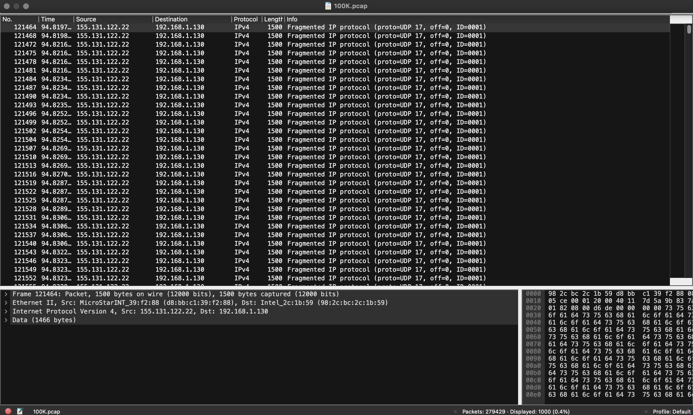

# DoS Traffic Analysis with Wireshark


---

## Project Overview
This project analyzes network traffic from a packet capture to identify Denial-of-Service (DoS) attack behavior.  
The dataset includes **UDP/QUIC attack traffic** from a single source IP. The goal is to show traffic anaylys skills through Wireshark.

---

## Dataset
- **Source:** Zenodo Open-Access DDoS Traffic Dataset  
- **File Used:** `100K.pcap` (~100,000 packets per second)  
- **Reference File:** `maliciousIPs.txt`   
- **Description:** UDP/QUIC traffic between a single source and destination. Payloads are encrypted.

---

## Tools Used
- Wireshark
- Protocol Hierarchy Statistics
- I/O Graphs
- IPv4 Conversations
- Display Filters (`ip.src`, `quic`)

---

## Analysis Process

### 1. Capture Overview
- Opened `100K.pcap` in Wireshark to observe total packet count and capture duration.
- Shows high packet volume within a short time frame.

### 2. Protocol Hierarchy Analysis
- **Statistics → Protocol Hierarchy** to identify dominant protocols.
- UDP is the main transport protocol.
- QUIC accounts for most application-layer traffic.
- Payloads are encrypted, typical for QUIC.


### 3. Traffic Volume (I/O Graph)
- Generated **I/O Graph** showing packets per second.
- Observed **sustained high packet rate**, consistent with DoS attacks.


### 4. IP Conversations
- **Statistics → Conversations → IPv4** to identify the top source IP.
- Single source IP is responsible for the majority of packets sent to a single destination IP.


### 5. Display Filtering
- Filtered by top source IP:
```text
ip.src == <top IP address>
````

* Filtered by QUIC protocol:

```text
quic
```

* Confirmed all packets were **UDP/QUIC traffic with protected payloads** to the same destination.




---

## Key Observations

| Characteristic       | Observation                  |
| -------------------- | ---------------------------- |
| Attack Type          | DoS                          |
| Transport Protocol   | UDP                          |
| Application Protocol | QUIC                         |
| Payload Visibility   | Encrypted / Protected        |
| Source IPs           | Single dominant IP           |
| Destination IPs      | Single target IP             |
| Packet Rate          | Extremely high and sustained |

---

## Conclusion

* The capture demonstrates DoS behavior using UDP/QUIC.
* A single source IP floods a single destination IP with encrypted packets.
* Patterns clearly show this attack from normal network behavior.

---
